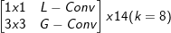
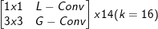
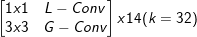

# CondenseNet-PyTorch

A PyTorch implementation of [CondenseNet: An Efficient DenseNet using Learned Group Convolutions](https://arxiv.org/pdf/1711.09224.pdf)

## Table of Contents:
<!-- Table of contents generated generated by http://tableofcontent.eu -->
- [CondenseNet-PyTorch](#condensenet-pytorch)
    - [Project structure](#project-structure)
    - [Data](#data)
    - [Model](#model)
    - [Experiment configs](#experiment-configs)
    - [Usage](#usage)
    - [Results](#results)
    - [Requirements](#requirements)
    - [Future Work](#future-work)
    - [References](#references)
    - [License](#license)

### Project structure:
```
├── agents
|  └── condensenet.py # the main training agent
├── graphs
|  └── models
|  |  └── condensenet.py
|  |  └── denseblock.py
|  |  └── layers.py
|  └── losses
|  |  └── loss.py # contains cross entropy loss definition
├── datasets  # contains all dataloaders for the project
|  └── cifar10.py # dataloader for cifar10 dataset
├── data
|  └── cifar10  # contains raw dataset
├── utils # utilities folder containing metrics , config parsing, etc
|  └── assets
├── main.py
└── run.sh
```

### Data:
Dataloader is responsible for downloading (first time only) and preparing cifar10 data. 

### Model:
To be able to reproduce the results from the official implementation, we use the default model of cifar10 and its configs as given [here](https://github.com/ShichenLiu/CondenseNet).

| CondenseNet                | Feature map     |
| -------------------------- |:---------------:|
| 3x3 Conv (stride =1)       |     32x32       |
||     32x32       |
| 2×2 average pool, stride 2 |     16x16       |
||     16x16       |
| 2×2 average pool, stride 2 |      8x8        |
||      8x8        |
| 8x8 global average pool    |      1x1        |
| 10-dim fully-connected     |                 |

### Experiment configs:
```
- Input size: 32x32x3
- Batch size: 64
- Learning rate: 0.1 following a consine type
- Optimizer: SGD
- Number of epochs: 300
- Condensation Stages: [14, 14, 14]
- Growth Rate: [8, 16, 32]
```
### Usage:
- To run the project, you need to add your configurations into the folder ```configs/``` as found [here](https://github.com/hagerrady13/CondenseNet-Pytorch/blob/master/configs/condensenet_exp_0.json)
- ``` sh run.sh ```
- To run on a GPU, you need to enable cuda in the config file.

### Results:
| Metric       | Reproduced  | Official    |
| ------------ |:-----------:|:-----------:|
| Top1 error   |    4.78%    |             |
| Top5 error   |    0.15%    |             |

### Requirements:
- Pytorch: 0.4.0
- torchvision: 0.2.1
- tensorboardX: 1.2

Check [requirements.txt](https://github.com/hagerrady13/CondenseNet-PyTorch/blob/master/requirements.txt).

### Future Work:
* Add network profiling for counting the number of FLOPS
* Implement the condensation layers to optimize the model for inference

### References:
* CondenseNet official implementation in PyTorch: https://github.com/ShichenLiu/CondenseNet

### License:
This project is licensed under MIT License - see the LICENSE file for details.
